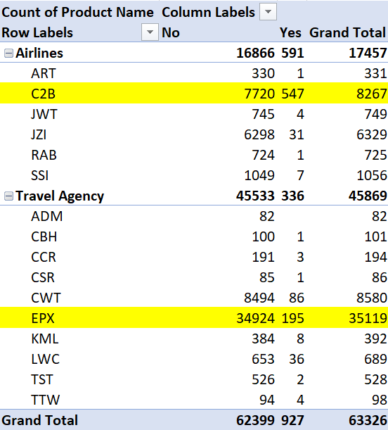
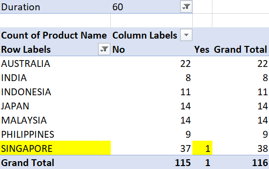
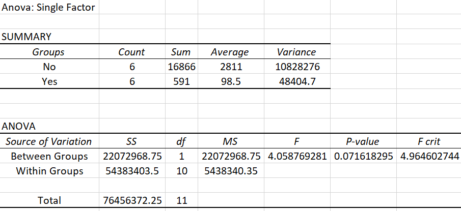
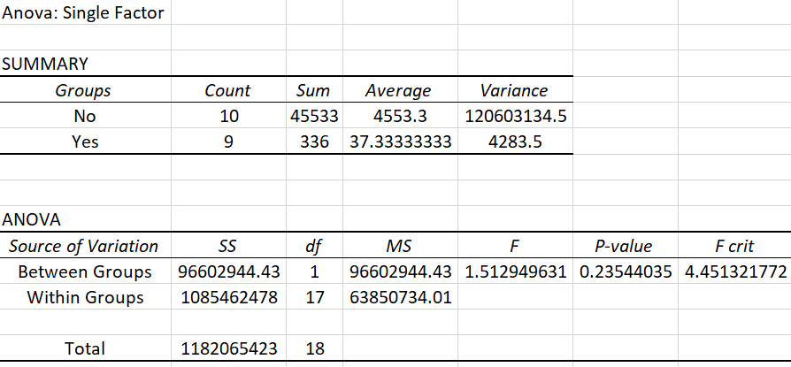
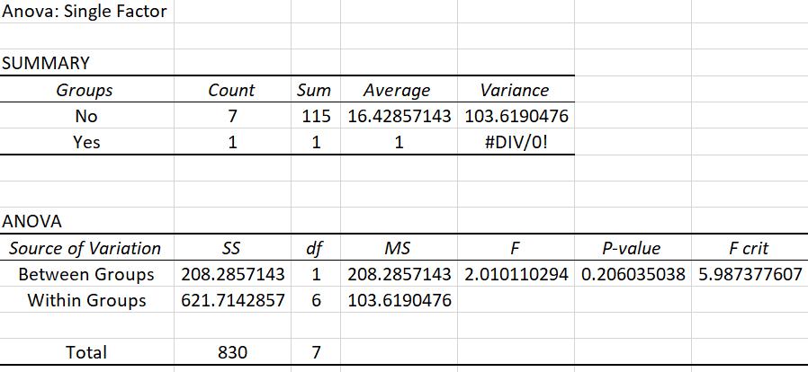
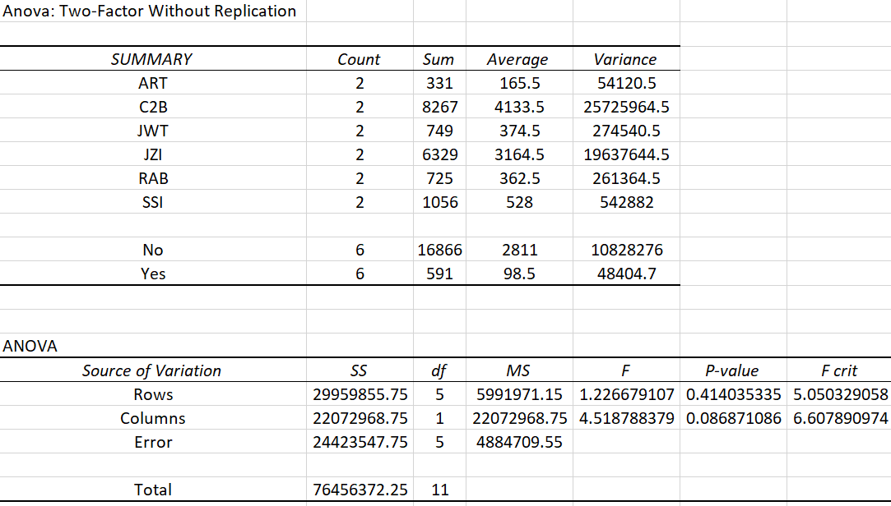
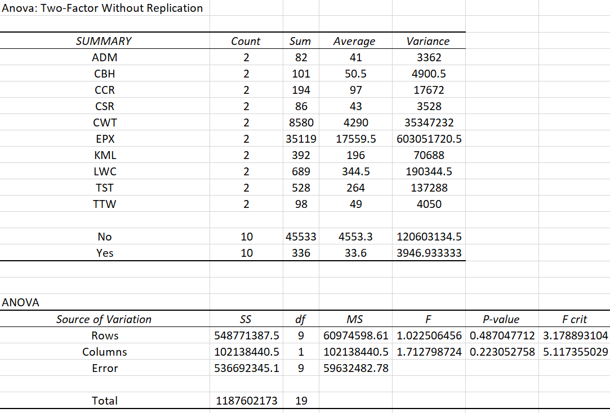
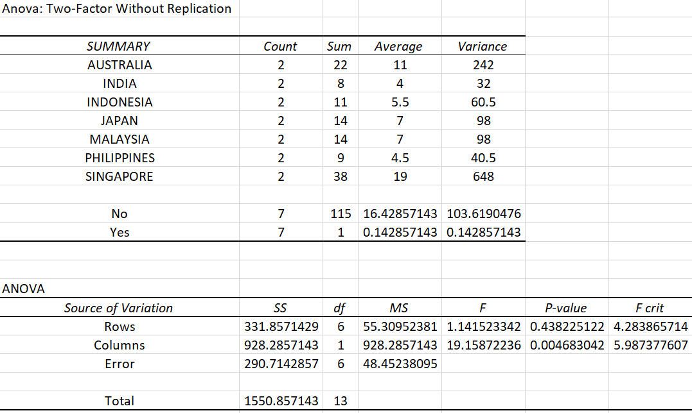

# Team-titans

# Sprint 3
## Missing Value Treatment
### Determine which column has missing values
print(df.isnull().sum())

### Remove the column as approximately 70% are missing values
updated_df = df.dropna(axis=1)
print(updated_df.info())

## Outlier Analysis
from scipy import stats
import numpy as np

### Find Z-score for Duration
z1 = np.abs(stats.zscore(df['Duration']))
print(z1)

threshold = 3

### Position of the outlier for Duration
print(np.where(abs(z1) > 3))

### Find Z-score for Net Sales
z2 = np.abs(stats.zscore(df['Net Sales']))
print(z2)

threshold = 3

### Position of the outlier for Net Sales
print(np.where(abs(z2) > 3))

### Find Z-score for Commision
z3 = np.abs(stats.zscore(df['Commision (in value)']))
print(z3)

threshold = 3

### Position of the outlier for Commision
print(np.where(abs(z3) > 3))

### Find Z-score for Age
z4 = np.abs(stats.zscore(df['Age']))
print(z4)

threshold = 3

### Position of the outlier for Age
print(np.where(abs(z4) > 3))

## Identify outlier (graphical method)
### boxplot method(for Duration)
f,a=plt.subplots(figsize=(10,6))
sns.boxplot(df['Duration'])
plt.title("Boxplot of Duration")

### boxplot method(for Net Sales)
f,a=plt.subplots(figsize=(10,6))
sns.boxplot(df['Net Sales'])
plt.title("Boxplot of Net Sales")

###` boxplot method(for Commision)
f,a=plt.subplots(figsize=(10,6))
sns.boxplot(df['Commision (in value)'])
plt.title("Boxplot of Commision")

### boxplot method(for Age)
f,a=plt.subplots(figsize=(10,6))
sns.boxplot(df['Age'])
plt.title("Boxplot of Age")

## Count for outliers
### Duration
d_mean=df['Duration'].agg(['mean','std'])
mu = d_mean.loc['mean']
sigma = d_mean.loc['std']
def get_outliers(df, mu=mu, sigma=sigma, n_sigmas=3):
    x = df['Duration']
    mu = mu
    sigma = sigma
    
    if (x > mu+n_sigmas*sigma) | (x<mu-n_sigmas*sigma):
        return 1
    else:
        return 0

df['outliers']=df.apply(get_outliers,axis=1)

print(df.outliers.value_counts())

### Net Sales
d_mean=df['Net Sales'].agg(['mean','std'])
mu = d_mean.loc['mean']
sigma = d_mean.loc['std']
def get_outliers(df, mu=mu, sigma=sigma, n_sigmas=3):
    x = df['Net Sales']
    mu = mu
    sigma = sigma
    
    if (x > mu+n_sigmas*sigma) | (x<mu-n_sigmas*sigma):
        return 1
    else:
        return 0

df['outliers']=df.apply(get_outliers,axis=1)

print(df.outliers.value_counts())

### Commision

d_mean=df['Commision (in value)'].agg(['mean','std'])
mu = d_mean.loc['mean']
sigma = d_mean.loc['std']
def get_outliers(df, mu=mu, sigma=sigma, n_sigmas=3):
    x = df['Commision (in value)']
    mu = mu
    sigma = sigma
    
    if (x > mu+n_sigmas*sigma) | (x<mu-n_sigmas*sigma):
        return 1
    else:
        return 0

df['outliers']=df.apply(get_outliers,axis=1)

print(df.outliers.value_counts())

### Age
d_mean=df['Age'].agg(['mean','std'])
mu = d_mean.loc['mean']
sigma = d_mean.loc['std']
def get_outliers(df, mu=mu, sigma=sigma, n_sigmas=3):
    x = df['Age']
    mu = mu
    sigma = sigma
    
    if (x > mu+n_sigmas*sigma) | (x<mu-n_sigmas*sigma):
        return 1
    else:
        return 0

df['outliers']=df.apply(get_outliers,axis=1)

print(df.outliers.value_counts())

## Data transformation(log transformation)
log_v=['Duration','Net Sales','Commision (in value)','Age']
u=plt.figure(figsize=(25,10))
for i in range(len(log_v)):
    v=log_v[i]
    trf= "log_"+v
    updated_df[trf]=np.log10(updated_df[v]+1)
    
    s=u.add_subplot(2,5,i+1)
    s.set_xlabel(v)
    updated_df[trf].plot(kind='hist')

## Data transformation(arrange row)
p=pd.DataFrame(updated_df,columns=['Product Name', 'Destination', 'Distribution Channel','Agency','Agency Type','Age','Gender','Claim','Duration','Net Sales','Commision (in value)'])
print(p)

plt.show()

# Sprint 5
## Pivot Tables
### Pivot Table 1 (Claim frequency of each agency)

### Pivot Table 2 (Claim frequency of specific destinations with duration = 60)

## One Way Analysis
### Airlines

### Travel Agency

### Destination

## Two Way Analysis
### Airlines

### Travel Agency

### Destination

